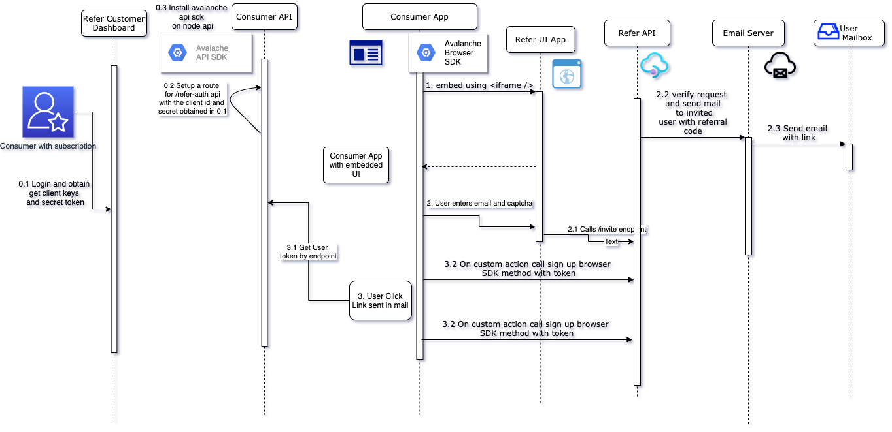

## Preview

Avalanche app provides an end to end safe and secure solution for inviting users based on their emails or from google contacts, the consumers of the app are Corporates/startups who want customized/zero-config referral system that works and scales, and it is super secure. 

## Components Involved

The components of avalanche app are:

* An embeddable [UI](https://refer-ui-two.vercel.app/)
* A customer dashboard [app](https://refer-customer-dashboard.vercel.app/)
* A backend [api](http://salty-reef-38656.herokuapp.com/)
* Browser SDK [Package](https://www.npmjs.com/package/avalanche-browser).
* Node.js SDK [Package](https://www.npmjs.com/package/avalanche-api).


### Flow diagram for simple email invite


### Using Avalanche SDK

First step is to sign up on [customer app](https://refer-customer-dashboard.vercel.app/) and grab your `client_id` and `client_secret`.

Install our [avalanche api package](https://www.npmjs.com/package/avalanche-api) on the server and import it using

```
  const avalancheApi = require('avalanche-api');
```
or if you use ES7/TS or above 

```
  import avalancheApi from 'avalanche-api'
```

If you use Node.js Server, create a route 

```
app.get('/refer-api-auth', async (_, res) => {
  const data = await avalancheApi.getApiToken({
    clientId: "xxivyv....",
    clientSecret: "nKqLZ1n0...."
  });
  # Token will be a bearer token which will look like Bearer eyxv.....
  res.json({
    token: data
  })
});
```

### NOTE: This route will be providing you a session token with your secret credentials and that token will be used to idenitfy/authenticate the request your app will make to our api.

On the UI Side, we have an embeddable iframe container which can be embedded using

```
<iframe 
  sandbox="allow-top-navigation allow-scripts allow-same-origin allow-forms" 
  height="500px" 
  width="800px" 
  src={`${REFERAPP_URL}?email=${email}&name=${name}&base_url=${APP_BASE_URL}&redirect_uri="http://localhost:3000/explore"&token=${token}`} />
```
### NOTE: Here REFERAPP_URL points to https://refer-ui-two.vercel.app/ and email is the email of logged in used user, name is the name of logged in user, APP_BASE_URL is the base url which will be used in the emails sent to the users, it should refer to the landing page for the users clicking on link sent in email,the redirect_uri is the url of page where the app can redirect users back after the invites are sent using google contacts, and the token is the token obtained from `/refer-api-auth` endpoint above.

when a new user signs up with referral code, call the method signupMySDK with the session token, this will mark the user signed_up on our system

when a new user reaches a premium level, call the premium sdk method

when a user reaches upgraded mark him upgraded by calling our sdk method
